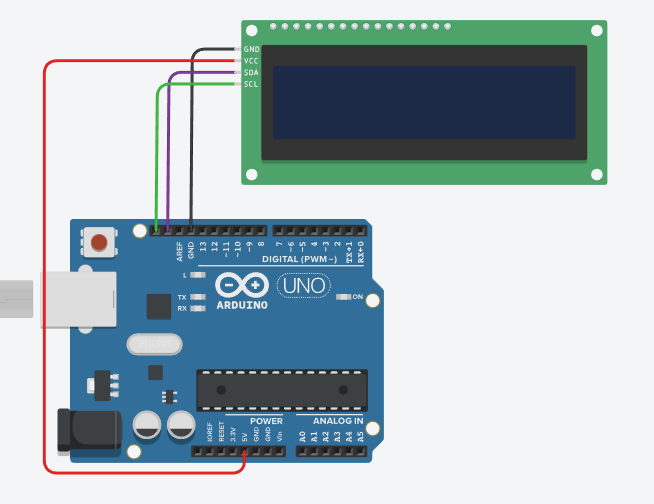
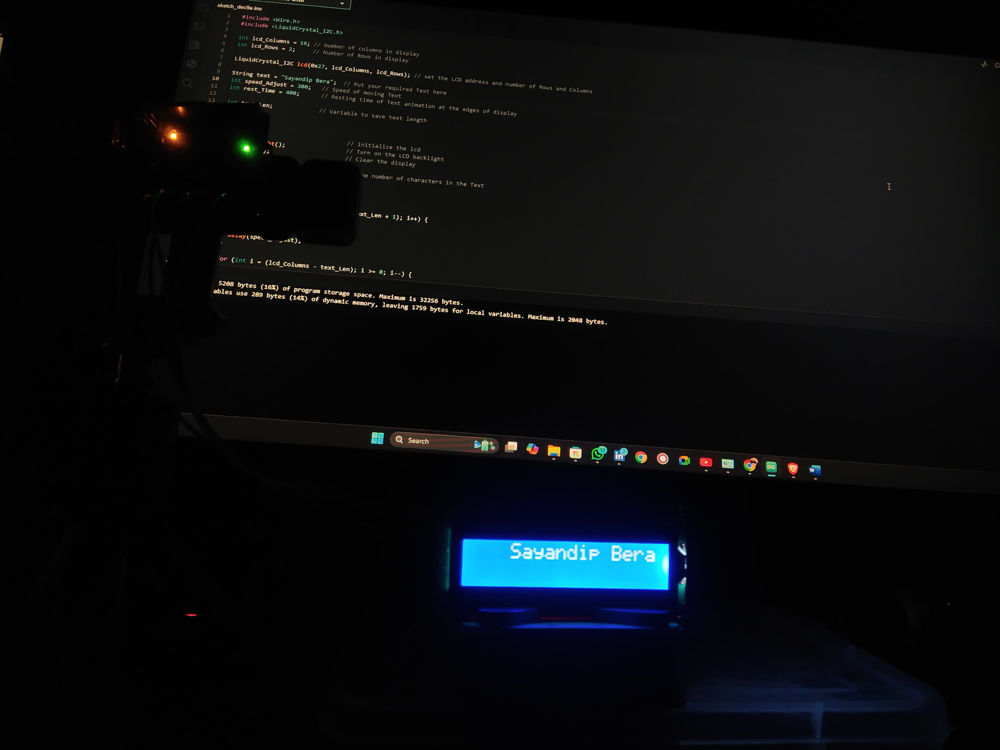

# Stylish LCD Text Animations with Arduino

This is a beginner-level project showcasing stylish text animations on an **I2C LCD display** using **Arduino UNO**. The project demonstrates creative text movements like bouncing, zigzagging, and scrolling.

## 💡 Project Overview
As an **ECE engineering student** who loves programming, I occasionally dive into the world of hardware tinkering. Arduino and Raspberry Pi Pico projects often catch my attention, and this is one of the many beginner-level projects I’m working on. It bridges my passion for software with the tangible world of electronics.

## ✨ Features
- **Bounce Animation**: Text moves back and forth horizontally.
- **Zigzag Animation**: Text follows a zigzag pattern across rows and columns.
- **Scrolling Text**: Smooth ticker-style animation for dynamic effects.

## 🛠️ Hardware Requirements
- Arduino UNO
- I2C LCD Display (16x2)
- Jumper Wires
- Breadboard

## 🔧 Software Requirements
- Arduino IDE

## 🔌 Pin Diagram and Connections
To connect the I2C LCD Display to the Arduino UNO, use the following wiring:

| LCD Pin | Arduino Pin |
|---------|-------------|
| GND     | GND         |
| VCC     | 5V          |
| SDA     | A4          |
| SCL     | A5          |

 *(Replace with actual image URL)*

### Project Preview
Here is how the project looks when running:



*(Replace `./preview.jpg` with the actual path to your preview image in the repository)*

## 📜 How It Works
1. **Setup the Hardware**:
   - Place the I2C LCD Display on the breadboard.
   - Use jumper wires to connect the LCD pins to the Arduino as per the table above.

2. **Install Libraries**:
   - Open the Arduino IDE.
   - Go to **Tools > Manage Libraries**.
   - Search for `LiquidCrystal_I2C` and install it.

3. **Upload the Code**:
   - Copy the code from the project file.
   - Connect the Arduino UNO to your computer via USB.
   - Select the correct **COM Port** and **Board Type** in the Arduino IDE.
   - Upload the code.

4. **Watch the Animations**:
   - Power on the Arduino UNO and observe the stylish text animations on the LCD display.

## 📄 Code Highlights
The project code includes three primary animation functions:
- `bounceAnimation()`: Creates a back-and-forth motion.
- `zigzagAnimation()`: Text alternates positions diagonally.
- `scrollingAnimation()`: Simulates a scrolling ticker effect.

```cpp
void bounceAnimation() {
  for (int j = 0; j < lcd_Rows; j++) {
    for (int i = 0; i < (lcd_Columns - text_Len + 1); i++) {
      lcd.clear();
      lcd.setCursor(i, j);
      lcd.print(text);
      delay(speed_Adjust);
    }

    for (int i = (lcd_Columns - text_Len); i >= 0; i--) {
      lcd.clear();
      lcd.setCursor(i, j);
      lcd.print(text);
      delay(speed_Adjust);
    }
  }
}
```

## 🌱 Future Plans
- Explore similar animations with **Raspberry Pi Pico**.
- Integrate more complex animations and effects.
- Experiment with IoT-based innovations by combining software and hardware.

## ❤️ About Me
I’m an **ECE engineering student** with a strong love for programming. While I primarily work on software projects, hardware tinkering with Arduino and Raspberry Pi fascinates me. This project is just the beginning of a series of fun experiments bridging these domains.

## 🏷️ Tags
- Arduino
- I2C LCD
- Beginner Project
- ECE Engineering
- Programming and Electronics

## 📬 Feedback
Have suggestions or ideas to enhance this project? Feel free to reach out or share your thoughts in the comments!

---
**Made with ❤️ by Sayandip Bera**
